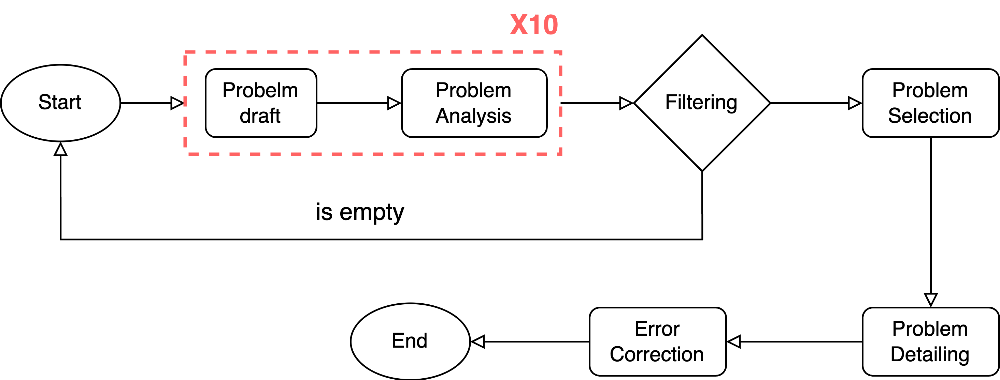
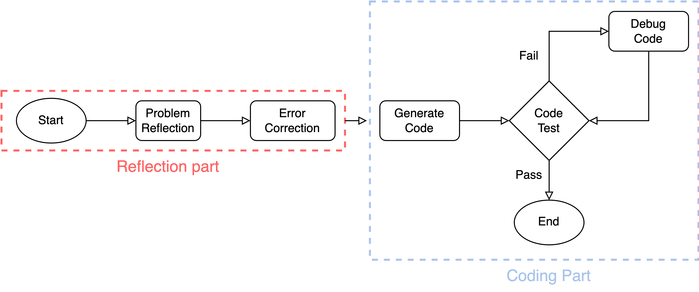
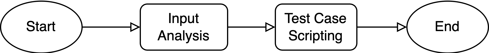

# CPPG - Competitive Programming Problem Generator

## Requirements

- Python 3.12

## Installation

1.  **Create and activate a virtual environment:**
    Choose the appropriate command for your operating system:
    
    **Linux/macOS:**
    ```console
    python3 -m venv venv
    source ./venv/bin/activate
    ```

    **Windows (cmd):**
    ```console
    .\venv\Scripts\activate.bat
    ```

    **Windows (PowerShell):**
    ```console
    .\venv\Scripts\activate.ps1
    ```
2.  **Install dependencies:**

    ```console
    pip install -r requirements.txt
    ```
3.  **Configure API Keys:**

    *   Create a `.secrets.toml` file in the `./src/configs/` directory.
    *   Add your Gemini API keys to the file:

        ```toml
        GEMINI_API_KEY = "YOUR_GEMINI_API_KEY"
        ```

## Running the Application

```console
uvicorn app:app --reload
```
The `--reload` flag enables automatic server restarts upon code changes, which is helpful during development.

The application will be available at http://localhost:8000/

## How it works

This generator has three main parts:

1.  **Problem Generation**
2.  **Solution Generation**
3.  **Test Case Generation**

Detailed steps for each part:

### 1. Problem Generation

*   **Problem Draft:**
    *   Based on the selected skill, randomly grab 5 samples from Codeforces as a few-shot prompt to generate problems (problem description only).
*   **Problem Analysis:**
    *   Use RAG (Retrieval-Augmented Generation) to compare problem description and grab similar problems (top\_10 chunk) to determine the similarity, difficulty and relate algorithm of the generated problem.
    *   *Note: Steps 1 & 2 run concurrently five times to generate five problems.*
*   **Problem Selection & Filtering:**
    *   Delete problems that are out of range or do not include the given skill (if all are out of range, rerun from the beginning).
    *   From the remaining problems, select the one with the lowest similarity and highest difficulty.
*   **Problem Detailing:**
    *   Complete the selected problem with full details.
*   **Error Checking & Correction:**
    *   Check and correct errors in the problem description.

### 2. Solution Generation

*   **Problem Reflection:**
    *   Think about how to solve the problem.
*   **Solution Verification:**
    *   Check if the problem and the solution are correct.
*   **Coding Solution:**
    *   Implements the solution in code.
*   **Test Code:**
    *   Verifies that the solution passes the sample tests.
*   **Debug Code:**
    *   Identifies and corrects any issues in the code.

### 3. Test Case Generation

*   **Input Analysis:**
    *   Use LLM to analyze the input constraints and structure of the problem input.
*   **Test Case Scripting:**
    *   The analysis is passed to an LLM, which then generates a Python script to create test cases.

## Workflows
### Problem Generation


### Solution Generation


### Test Case Generation


## Observability
This application is instrumented for observability using Phoenix. You can view traces of all calls at: http://localhost:6006/.